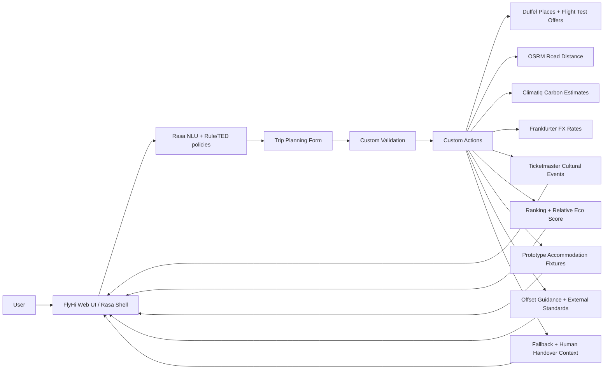

# FlyHi v3 Architecture

## Boundaries

- Duffel is used for place resolution and flight offers. Test/sandbox data must not be described as live bookable fares.
- Climatiq provides transport carbon estimates. FlyHi's Eco Score is a relative comparison inside the current result set, not a certification.
- OSRM supplies road distance; Frankfurter supplies reference FX conversion.
- Ticketmaster supplies cultural event information and may change after retrieval.
- Rail/car prices and accommodation are explicitly labelled prototype estimates/fixtures.
- Offset guidance is educational. FlyHi does not sell offsets or claim that purchasing an offset makes a trip carbon-neutral.
- Manual location input is used by the trip form; GPS is not required for this prototype.
